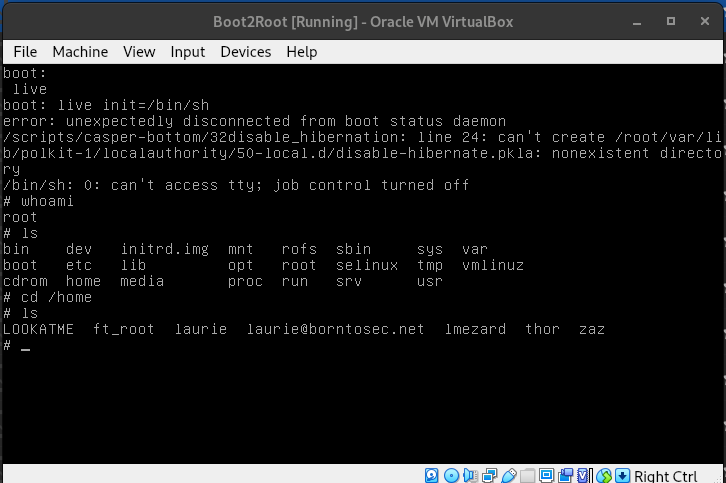

# Exploit the VM init program

When booting the VM and pressing the `shift` button, we enter the GNU GRUB menu.  
When the VM starts, it runs a program called "init", usually found at /bin/init or /sbin/init. This program is responsible for all the system startup and creating a usable environment.
By specifying `init=/bin/sh`, we tell the kernel to run `/bin/sh` instead, which will give us a shell as root.  

